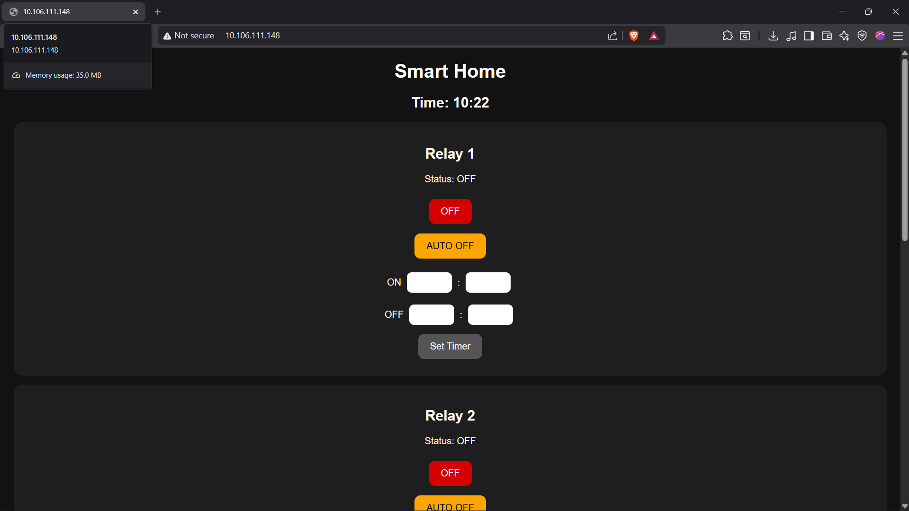
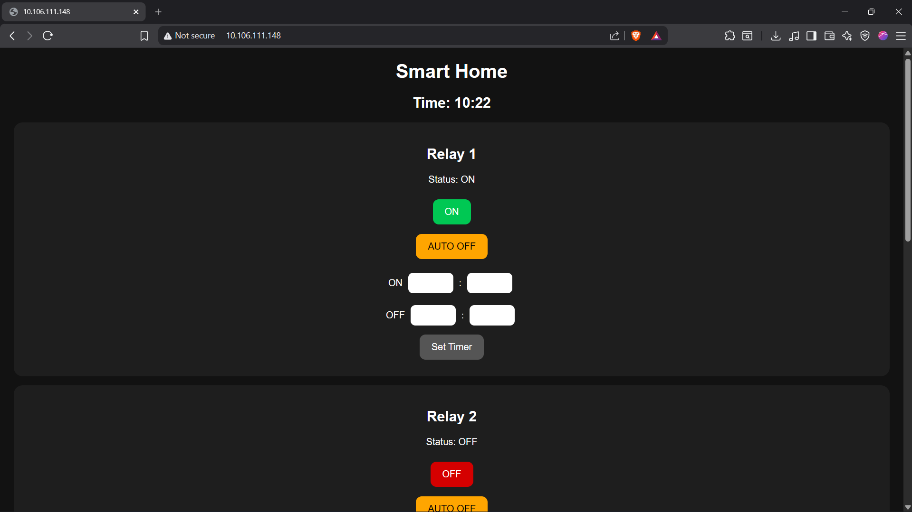
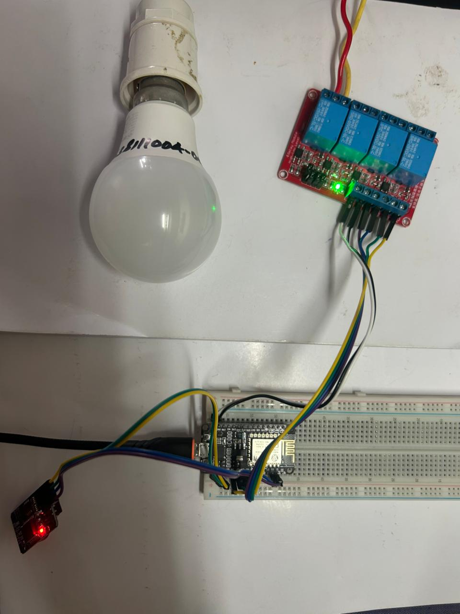
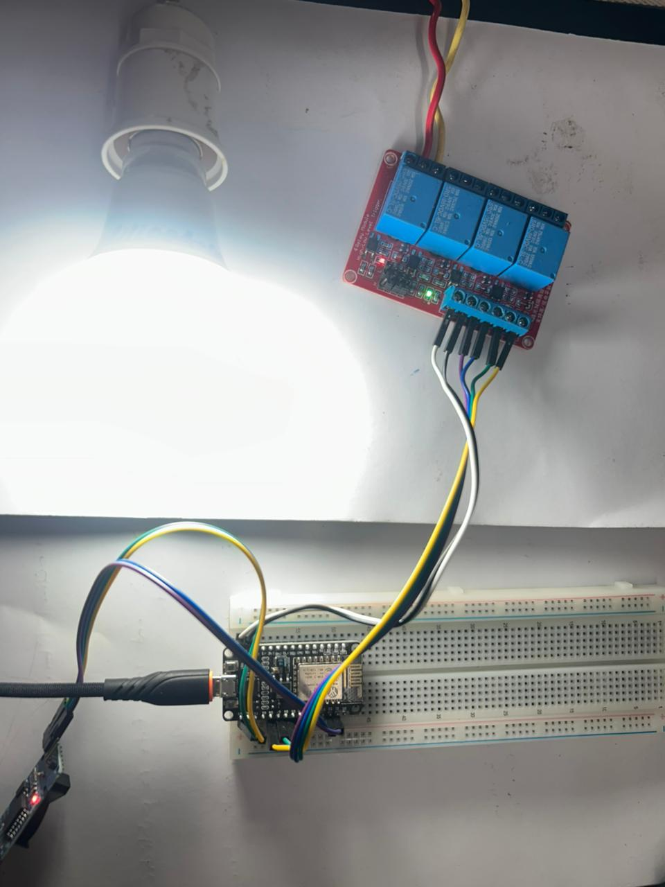
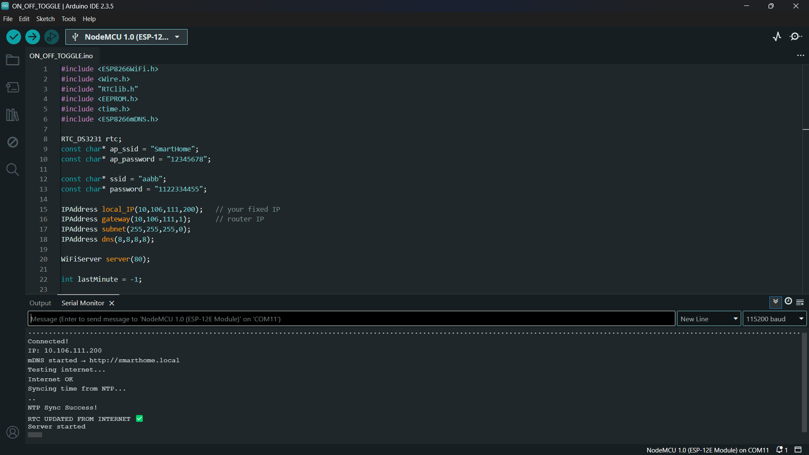

# 🏠 Smart Home Automation System (ESP8266) — Version 1

🚀 Built from scratch — hardware + firmware + web UI

---

## 📌 Overview

This project is a complete IoT-based Smart Home system using ESP8266.

It allows users to control appliances via a web interface, with real-time scheduling and automatic control using RTC + NTP.

---

## 🚀 Features

* 🔌 4 Relay Control
* 🌐 Web Dashboard (Mobile Friendly)
* ⏰ RTC Scheduling (DS3231)
* 🌍 NTP Auto Time Sync
* 💾 EEPROM Storage
* 🔁 Auto + Manual Modes
* 📡 AP + WiFi Mode

---

## 📸 Project Demonstration

### 🌐 Web Interface

**UI - OFF State**


**UI - ON State**


---

### 🔌 Hardware Output

| Relay OFF                    | Relay ON                    |
| ---------------------------- | --------------------------- |
|  |  |

---

### 📟 Serial Monitor (System Logs & NTP Sync)



---

## 🧠 Architecture

User (Phone/Laptop)
↓
Web UI (Browser)
↓
ESP8266
↓
RTC + EEPROM + Relay Module
↓
Appliances

---

## ⚙️ Hardware Used

* ESP8266 (NodeMCU)
* 4 Channel Relay Module
* DS3231 RTC
* Breadboard & Wires

---

## 💻 Code

📂 Located in:

```
/code/smart_home_v1.ino
```

---

## 🔥 Key Achievements

* Built full system from scratch
* Solved RTC timing issues
* Implemented NTP sync
* Designed real-time UI
* Implemented persistent storage

---

## 🛠 Challenges Solved

* Incorrect RTC time
* WiFi fallback (AP mode)
* NTP failure debugging
* EEPROM stability

---

## 🔜 Version 2 (Coming Next)

* 🔐 Login Authentication
* ⏱ Multiple Timers per Relay
* 📱 Mobile App Integration
* ☁ Cloud Integration (Firebase / MQTT)
* 🎨 Advanced UI

---

## 👨‍💻 Author

Aswath

---

⭐ If you like this project, give it a star!
